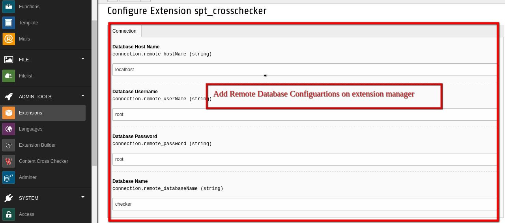

.. ==================================================
.. FOR YOUR INFORMATION
.. --------------------------------------------------
.. -*- coding: utf-8 -*- with BOM.

.. include:: ../Includes.txt

.. _admin-manual:

Administrator Manual
====================

Target group: **Administrators**

This extension helps the user to get the modified / added contents between a particular period of time.

.. _admin-installation:

Installation
------------

To install the extension, perform the following steps:

#. Go to the Extension Manager
#. Install the extension
#. Load the static template
#. Click in backend module

.. _admin-configuration:

Configuration
-------------

* Need to enter the database details in the extension manager confugration.

   Database Configurations