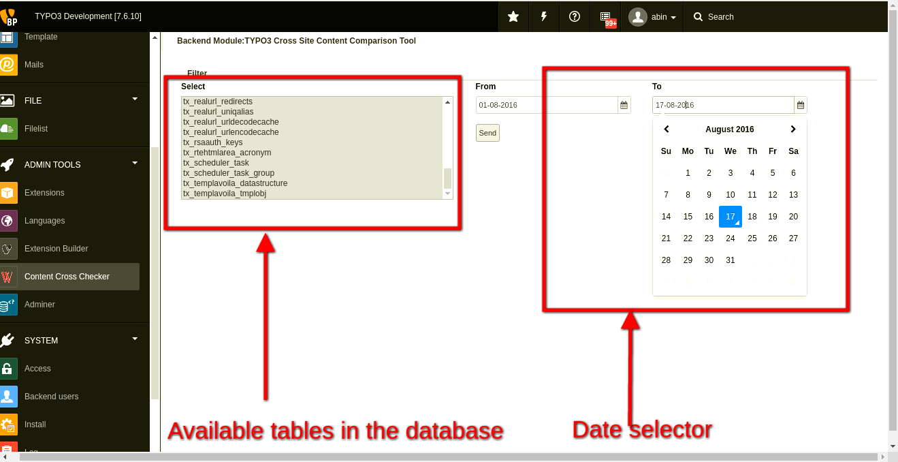
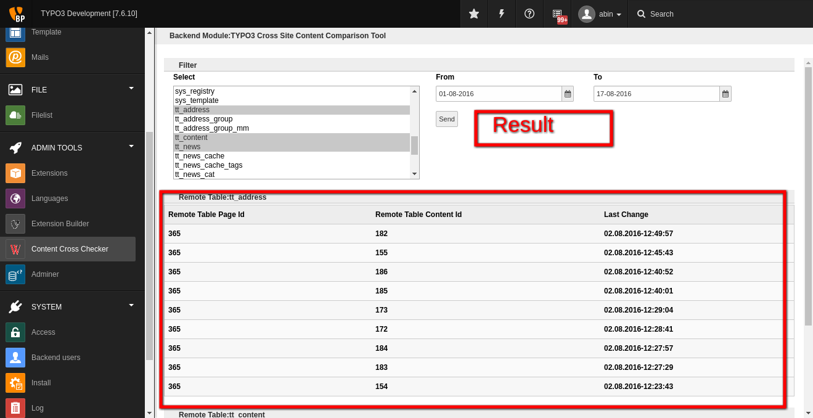

.. ==================================================
.. FOR YOUR INFORMATION
.. --------------------------------------------------
.. -*- coding: utf-8 -*- with BOM.

.. include:: ../Includes.txt

.. _introduction:

Introduction
============

This extension helps the backend user to get the modified / added contents between a particular period of time.

.. important::

   Please don't forget include your static template (from extensions).

.. _screenshots:

Screenshots
-----------

How the extension works
-----------

Filter

   Filter

Result

   Result